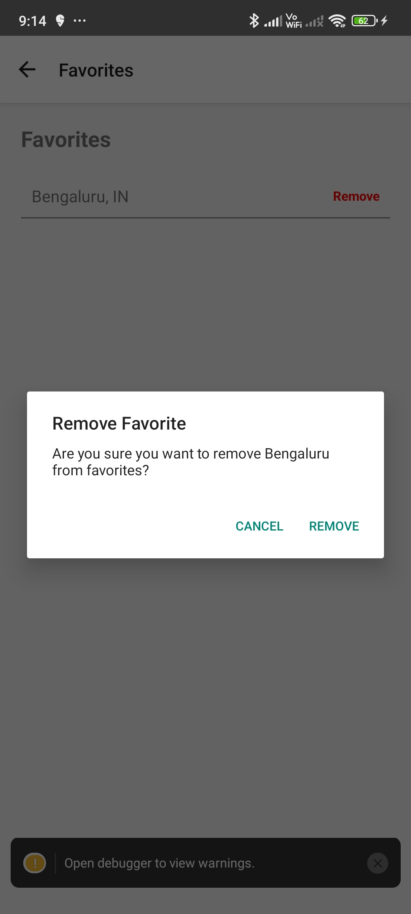

# Weather App

A cross-platform React Native application that provides real-time weather information, location-based forecasts, and a favorites system. Built with modern state management, native modules, and a clean, user-friendly UI.

## Overview

Weather App allows users to:

- View current weather and 2-day forecasts for their location or any searched city.
- Save favorite locations for quick access.
- Handle location permissions and errors gracefully.

## Features

- **Current Weather:** Fetches weather data for the user's current location using native module.
- **Search:** Search for weather in any city.
- **2-Day Forecast:** Displays a concise forecast grid.
- **Favorites:** Add/remove favorite locations, persisted with Redux and AsyncStorage.
- **Location Permissions:** Robust handling of permission denial and location service status.
- **Animated UI:** Fade-in effects for weather cards.
- **Error Handling:** User-friendly alerts and actionable error screens.

## Technical Implementation

### Core Technologies

- **React Native 0.80+**
- **Redux Toolkit** for state management
- **AsyncStorage** for persistence
- **TypeScript** for type safety
- **Custom Native Module:** Kotlin and Swift based location provider with permission/service checks and timeout handling
- **Weather API Integration:** Fetches data from a weather API (e.g., OpenWeatherMap) via a service layer

### Advanced Features

- **Native Modules & Bridge**
  - Native bridfe module using traditional architecture
  - iOS: CoreLocation integration with swift
  - Android: LocationManager integrationn with Kotlin
  - Javascript integration with fallback implementation

- **Hermes Engine**
  - Enabled in `android/app/build.gradle` and `ios/Podfile`
  - Optimizes startup time and memory usage on both platforms
  - Imrpoves JavaScript execution performance  

- **Code Splitting & Lazy Loading**
  - Weather modal component lazy loaded with `React.lazy`
  - Wrapped in `Suspense` for loading states
  - Improves initial bundle size

- **Hooks Implementation**
  - `useState` for search input and weather data
  - `useEffect` for API calls 
  - `useCallback` for performance optimation

- **Redux Architecture**
  - Centralized state management for favorites
  - AsyncStorage persistence with Redux Thunk
  - Type-safe actions and reducers

- **Flexbox Layout**
  - Responsive design using flexbox
  - Grid layout for forecast display
  - Adaptive UI for different screen sizes

## Setup Instructions

1. **Install dependencies:**

   ```sh
   npm install
   ```

2. **Android Setup:**

   - Open the `android` folder in Android Studio and build/run the app. (or)
   ```bash
   npm run android
   ```

3. **iOS Setup:**

   - Install CocoaPods if not present.
   - Run:
     ```sh
     cd ios
     pod install
     cd ..
     npm run ios
     ```

4. **API Key Configuration:**
   - Add your weather API key to a `.env` file.
   - Example `.env`:
     ```env
     OPEN_WEATHER_API_KEY=your_api_key_here
     ```

## Native Module Support

- **Android:** Custom location module written in Kotlin (see `android/app/src/java/com/weatherapp/LocationModule.kt`).
- **iOS:** Location support via Swift (see `ios/WeatherApp/LocationModule.swift`).

## Screenshots

| Home Screen - Location Access | Home Screen - Current Location Weather | Home Screen - Add to favorites | Home Screen - Added to favorites | Home Screen - Detailed Weather |
| ----------------------------- | ------------------------------- | ---------------- | ---------------------- | -------------------- |
|  |  |  |  |  |

| Favorites | Remove from Favorites | Removed from Favorites | Search | Error - when location is disabled |
| ----------------------------- | ------------------------------- | ---------------- | ---------------------- | -------------------- |
|  |  |  |  |  |
| Error - when network is disabled |
|  |

## Project Structure

```
WeatherApp/
├── App.tsx
├── src/
│   ├── components/
│   │   └── DetailedWeatherModal.tsx
│   ├── native/
│   │   └── LocationModule.ts
│   ├── screens/
│   │   ├── HomeScreen.tsx
│   │   └── FavoritesScreen.tsx
│   ├── services/
│   │   └── weatherAPI.ts
│   ├── store/
│   │   ├── favoriteSlice.ts
│   │   └── index.ts
│   ├── types/
│   │   └── weather.ts
│   └── utils/
│       └── networkUtils.ts
├── android/
│   └── app/src/main/java/com/weatherapp/LocationModule.kt
├── ios/
│   └── WeatherApp/
│       └── LocationModule.swift
├── package.json
├── README.md
└── ...
```

## API Integration

- **OpenWeatherMap API**: Current weather and 5-day forecast
- **Endpoints**:
- current: `api.openweathermap.org/data/2.5/weather`
- forecast: `api.openweathermap.org/data/2.5/forecast`
- **Authetication**: API key required

## Future Enhancements
- Handle dark mode support
- Add unit/UI tests